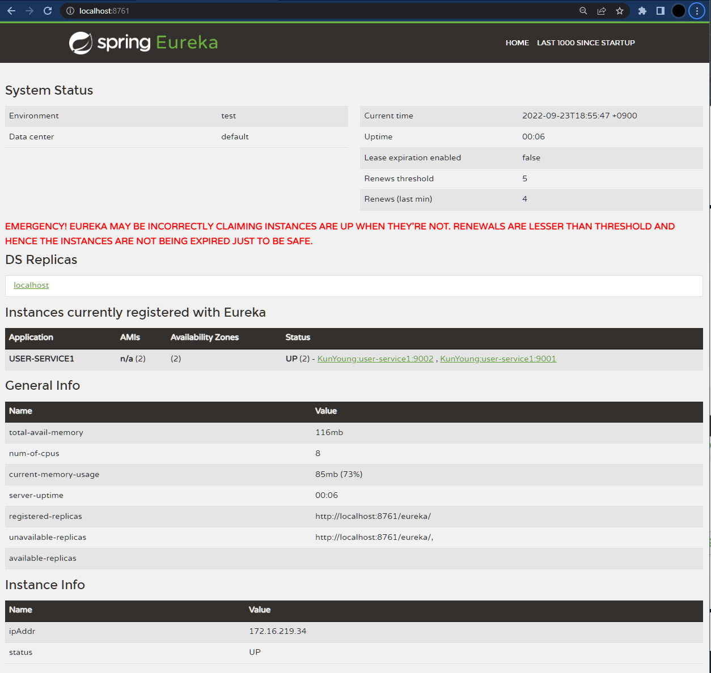

## ⭐ 마이크로서비스 인스턴스

```yaml
server:
  port: 9001

spring:
  application:
    name: user-service1

eureka:
  client:
    register-with-eureka: true
    fetch-registry: true
    service-url:
      defaultZone: http://localhost:8761/eureka/
```

|키워드| 설명          |
|:---|:------------|
|port: 9001| 9001로 포트 지정 |




## ✔️ 인스턴스 Scaling (랜덤으로 포트 등록)

```yaml
server:
  port: 0

spring:
  application:
    name: user-service1

eureka:
  instance:
    instanceId: ${spring.cloud.client.hostname}:${spring.application.instance_id:${random.value}}
  client:
    register-with-eureka: true
    fetch-registry: true
    service-url:
      defaultZone: http://localhost:8761/eureka/

```

| 키워드                    | 설명             |
|:-----------------------|:---------------|
| eureka.instance.instanceId | instance 정보 등록 |
